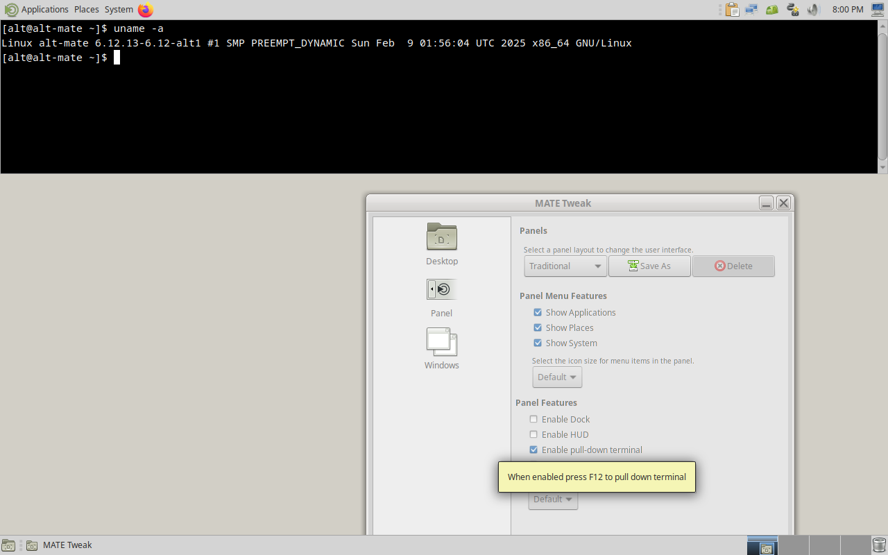

# alt-mate-ayatana-settings

This repository contains special package for ALT Linux and allows user to install fully-featured MATE desktop environment with Ayatana Indicators, which are currently in wide use only in Ubuntu MATE flavour (since 20.10 aka *groovy*) and later on Debian 12 (*bookworm*) by using similar approach in the [`debian-mate-ayatana-settings`](https://github.com/N0rbert/debian-mate-ayatana-settings) package.

First of all I would like to thank the developers of original [`ubuntu-mate-settings` package](https://github.com/ubuntu-mate/ubuntu-mate-settings/). It makes possible to bring the same concept to other GNU/Linux systems with MATE desktop environment and Ayatana Indicators.

## How to install and use this package

This package is prepared for the ALT Linux MATE StarterKit. The most reproducible method of installation would be to download the install image [*regular-mate-latest-x86_64.iso*](https://mirror.yandex.ru/altlinux-nightly/current/regular-mate-latest-x86_64.iso) and then install it as usual using default setup wizard.

Then login to the system as normal user using LightDM to see default MATE desktop environment as it was configured by ALT Linux community.


On the above image one can note the minimalism of traditional GNOME 2.32-like panel layout, such default MATE system has simple notification area without legacy AppIndicator and without modern Ayatana Indicators.

This freshly installed system should be configured - we need to login as *root* to update the package indexes, upgrade all packages and install this package:

```sh
$ su -
# apt-get update
# apt-get dist-upgrade
# apt-get install alt-mate-ayatana-settings
# reboot
```

Installation of this `alt-mate-ayatana-settings` package will also install minimal additional set of packages including MATE Tweak and MATE Panel layouts (Contemporary, Cupertino, Familiar, Fedora, Mutiny, Pantheon, Redmond, Tradional), Plank, Tilda, MATE HUD, MATE Panel Applets, MATE Dock Applet, Brisk Menu, Ayatana Indicators inside MATE Indicator Applet Complete (Application, Datetime, Messages, Notifications, Power, Session, Sound), Ayatana Settings and GNOME Evolution (works great with Ayatana Indicator Datetime, see below).

By default the system is configured to have Traditional layout of two MATE Panels with MATE Indicator Applet Complete at the top right corner. Below is the notable screenshot of Ayatana Sound indicator which allows to control media players (for example, Rhythmbox and VLC) using MPRIS D-BUS interface.


All other MATE Panel layouts are available from MATE Tweak utility:


so user can select any of the other layouts:

* Contemporary

    > Modernised two panel layout featuring a searchable menu with global menus.

    

* Cupertino

    > A dock and top panel with searchable launcher and global menus similar to macOS.

    

* Familiar

    > Two panel layout with a searchable menu.

    

* Mutiny

    > Application dock, searchable launcher and global menus similar to Unity 7.

    

* Netbook

    > Special layout for small screens, it has a single panel on the top, menu, clock, and list of open applications at the top of the screen.

    

* Pantheon

    > A dock and top panel with a searchable menu.

    

* Redmond

    > Single bottom panel with a searchable menu, similar to the taskbar in Windows.

    

All Ayatana indicators may be configured using their special application, it is located in *System* → *Preferences* → *Look and Feel* → *Indicators*.

Please note that all MATE Tweak functions are now enabled, so user can enable Plank Dock on any MATE panel layout and also:

* enable HUD and then call it pressing left `<Alt>`

    

* enable pull-down terminal (Tilda)

    

* enable keyboard LED indication (useful for modern devices without Caps Lock LED)

   

To view email notifications and subjects inside Ayatana Indicator Messages user should install and configure additional package named `ayatana-webmail`.

To view calendar events and appointments inside Ayatana Indicator Datetime user should configure calendar account inside GNOME Evolution which is preinstalled.

Other Ayatana indicators (such as `ayatana-indicator-a11y`, `ayatana-indicator-bluetooth`, `ayatana-indicator-display`, `ayatana-indicator-keyboard`, `ayatana-indicator-printers`) may also be installed depending on user needs.
